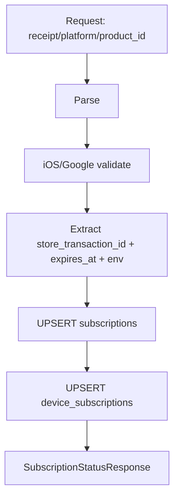

# Серверная валидация In-App Purchase (Apple App Store + Google Play)

Документ для бекенд-разработчика по реализации серверной валидации подписок через receipt / purchaseToken с последующим связыванием подписки с устройствами.

Ключевой контракт: клиент включает Premium только если `verify-receipt` вернул `status === "active"`. Любое другое значение `status` означает “не Premium”.

## Контракт с мобильным клиентом

### Аутентификация

- Заголовок: `Authorization: Bearer <token>`
- `device_id` берётся из JWT (бекенд уже умеет извлекать device UUID из `Authorization` через middleware `ContextDeviceUUID`).

### Endpoint: `POST /api/v1/subscription/verify-receipt`

Запрос:

```json
{
  "receipt": "<string>",
  "platform": "ios | android",
  "product_id": "<string>"
}
```

`receipt`:

- iOS: `transactionReceipt` (unified App Receipt / PKCS#7) в base64, без префиксов вроде `data:...;base64,`
- Android: `purchaseToken` (если недоступен — fallback на `transactionReceipt`, но для подписок токен обычно есть)

`product_id`:

- SKU из App Store / Play Billing: `com.volk.vpn.sub.weekly|monthly|yearly`
- При `restore purchases` клиент может прислать “чужой” `product_id` (не из наших SKU). В этом случае бекенд должен вернуть `status != "active"`.

Ответ:

```json
{
  "status": "active",
  "plan": "<string>",
  "expires_at": "2026-04-25T12:00:00Z"
}
```

Правила:

- `status`:
  - Любое значение кроме `"active"` означает “не Premium” на клиенте.
  - Клиент не различает причины (`expired`, `cancelled`, `billing_retry`, `grace_period`, `none`, `invalid`) — главное, чтобы не было `"active"`.
- `plan` и `expires_at`:
  - клиент не использует для логики включения Premium
  - рекомендуется возвращать `expires_at` как ISO-8601 UTC

Ошибки:

- `422` — невалидный receipt или ошибка валидации со стороны Apple/Google (клиент не включает Premium).
- `401` — невалидный/просроченный JWT (обработкой занимается текущий middleware).

Пример ошибки `422`:

```json
{
  "status": "invalid",
  "plan": "",
  "error": "Receipt validation failed: ..."
}
```

### Endpoint: `GET /api/v1/subscription/status`

Текущая логика проекта ищет активную подписку “по device_id”. Для кросс-девайсной логики нужно заменить поиск на цепочку:

`device_id` (из JWT) -> `device_subscriptions` -> `subscriptions`.

## Общая архитектура: как кросс-девайс доступ работает

Клиент не отправляет Apple ID / Google Account или `subscription_id`.
Вместо этого бекенд извлекает уникальный идентификатор подписки магазина:

- iOS: `originalTransactionId` (одинаковый на устройствах одного Apple ID)
- Android: `orderId`/`latestSuccessfulOrderId` из ответа Play Billing (одинаковый для аккаунта)

Дальше бекенд:

1. делает UPSERT в `subscriptions` по `store_transaction_id`
2. связывает текущий `device_id` с этой записью через `device_subscriptions`
3. возвращает `status/plan/expires_at`

```mermaid
flowchart TD
  DeviceA[Device A\ndevice_id=aaa] -->|POST /verify-receipt| Backend
  Backend -->|validate via Apple/Google| Store[Apple / Google]
  Store --> Backend
  Backend -->|UPSERT subscriptions\nstore_transaction_id=TX_123| DB[(DB)]
  Backend -->|UPSERT device_subscriptions\n(aaa -> TX_123)| DB

  DeviceB[Device B\ndevice_id=bbb] -->|GET /subscription/status| Backend
  Backend -->|lookup by device_subscriptions| DB
  DB --> Backend
```

## Целевая схема данных (PostgreSQL)

Ниже — схема под кросс-девайсные подписки.

### Таблица `subscriptions`

- одна запись на “подписку магазина” (auto-renewable subscription group)
- уникальность определяется `store_transaction_id`

Колонки (рекомендация по вашему ТЗ, адаптировано под UUID device в этом проекте):

- `id` UUID PK
- `store_transaction_id` TEXT UNIQUE NOT NULL
  - iOS: `originalTransactionId`
  - Android: `orderId` или предпочтительно `lineItems[].latestSuccessfulOrderId`
- `platform` TEXT NOT NULL (`ios` или `android`)
- `product_id` TEXT NOT NULL (SKU)
- `status` TEXT NOT NULL (`active`, `expired`, `cancelled`, `billing_retry`, `grace_period`)
- `expires_at` TIMESTAMPTZ
- `environment` TEXT (`sandbox` / `production`)
- `raw_receipt` TEXT (сохранённый receipt/token; полезно для ретраев/дебага)
- `created_at` TIMESTAMPTZ DEFAULT NOW()
- `updated_at` TIMESTAMPTZ DEFAULT NOW()

Индексы:

```sql
CREATE UNIQUE INDEX idx_subscriptions_store_tx
  ON subscriptions (store_transaction_id);

CREATE INDEX idx_subscriptions_status
  ON subscriptions (status);
```

### Таблица `device_subscriptions`

- связь N:1: много устройств к одной записи подписки магазина
- идемпотентность обеспечивается составным primary key

Рекомендованная структура под текущий проект:

- `device_id` UUID NOT NULL REFERENCES `devices(id)` ON DELETE CASCADE
- `subscription_id` UUID FK -> subscriptions(id)
- `linked_at` TIMESTAMPTZ DEFAULT NOW()

```sql
CREATE TABLE device_subscriptions (
  device_id UUID NOT NULL REFERENCES devices(id) ON DELETE CASCADE,
  subscription_id UUID NOT NULL REFERENCES subscriptions(id) ON DELETE CASCADE,
  linked_at TIMESTAMPTZ NOT NULL DEFAULT NOW(),
  PRIMARY KEY (device_id, subscription_id)
);

CREATE INDEX idx_device_subscriptions_device_id
  ON device_subscriptions (device_id);
```

### Важное замечание про текущую схему в репозитории

Сейчас в репозитории `subscriptions` привязана напрямую к `device_id` и имеет `UNIQUE(device_id)`.
Чтобы реализовать контракт “одна подписка магазина -> много устройств”, нужно:

- отказаться от `UNIQUE(device_id)` (иначе кросс-девайс работать не сможет)
- добавить ключ `store_transaction_id` и убрать привязку подписки к устройству в самой `subscriptions`
- добавить `device_subscriptions` как отдельную таблицу связи

Варианты миграции:

- Вариант A (рекомендуется): создать новые таблицы/колонки и привести код на чтение/запись к новой модели.
- Вариант B: “перепаковать” существующую таблицу `subscriptions` под новое назначение (менее безопасно без миграционных стратегий).

## Endpoint: `POST /api/v1/subscription/verify-receipt`

Шаги обработки:

1. Извлечь `device_id` из JWT (уже реализовано middleware’ом).
2. Проверить input:
   - `platform` должен быть `ios|android`
   - `product_id` не пустой
   - `receipt` не пустой
3. Провести валидацию через стор:
   - iOS: получить `originalTransactionId` и decode/проверить последнюю транзакцию
   - Android: вызвать `purchases.subscriptionsv2.get` по `purchaseToken`
4. Из ответа магазина извлечь:
   - `store_transaction_id`
   - `status` магазина + `expires_at`
   - актуальный `product_id`
   - `environment` (sandbox/production)
5. UPSERT в `subscriptions` по `store_transaction_id`.
6. UPSERT в `device_subscriptions` для текущего `device_id`.
7. Вернуть JSON:
   - `status: "active"` строго если подписка “сейчас” активна
   - иначе `status != "active"`



Политика по `product_id`:

- клиентский `product_id` используется для сверки/удобства, но главный источник истины — ответ Apple/Google
- если “чужой SKU”:
  - бекенд должен вернуть `status != "active"`
  - желательно не превращать это в `422` (чтобы не ломать UX restore), а отвечать `200` с `status: "none"` или `"invalid"`

## Endpoint: `GET /api/v1/subscription/status`

Требуемая логика (кросс-девайс):

1. По `device_id` найти записи в `device_subscriptions`, затем присоединить `subscriptions`.
2. Выбрать “лучшую” подписку строго из активных:
   - `status = 'active'`
   - `expires_at > now()`
   - порядок: `expires_at DESC`
3. Если активная подписка не найдена:
   - вернуть `{ status: "none", plan: "" }` (или `expired`, если хотите различать UX)
   - (опционально) если у найденной “последней” подписки `expires_at <= now()`, можно сделать re-validate через магазин, используя сохранённый `raw_receipt`

Рекомендованный SQL-скелет (активная подписка):

```sql
SELECT s.status, s.product_id, s.expires_at
FROM device_subscriptions ds
JOIN subscriptions s ON s.id = ds.subscription_id
WHERE ds.device_id = $1
  AND s.status = 'active'
  AND s.expires_at > now()
ORDER BY s.expires_at DESC
LIMIT 1;
```

## iOS: серверная валидация (App Store Server API v2)

### Контекст: receipt формата iOS

- На бэкенд приходит `transactionReceipt` из `react-native-iap` v12.
- Это unified App Receipt (StoreKit 1), base64 PKCS#7 container.
- Бэкенд получает receipt “как есть” (без префиксов и без JSON-обёрток).

### Получение `originalTransactionId` из unified receipt (PKCS#7)

Цель: локально извлечь `original_transaction_id` из PKCS#7 содержимого receipt.

Подход:

1. Base64 decode unified receipt.
2. Распарсить PKCS#7 (ASN.1) и извлечь inner payload.
3. Прочитать поля:
   - `original_transaction_id`
   - `product_id` (SKU)

Далее используем `original_transaction_id` как вход для App Store Server API v2.

### App Store Server API v2: получение истории

Используйте Get Transaction History V1:

- Production:
  - `GET https://api.storekit.itunes.apple.com/inApps/v1/history/{originalTransactionId}`
- Sandbox:
  - `GET https://api.storekit-sandbox.itunes.apple.com/inApps/v1/history/{originalTransactionId}`

Ответ содержит `signedTransactions` (массив JWS). Каждый элемент нужно:

1. Проверить подпись и decode payload (через App Store Server Library).
2. Из decoded payload извлечь актуальные поля для `subscriptions`.

Минимальные поля, которые нужны для вашей схемы:

- `originalTransactionId` -> `subscriptions.store_transaction_id`
- `productId` -> `subscriptions.product_id`
- `expiresDate` (Unix milli) -> `subscriptions.expires_at`
- `environment` -> `subscriptions.environment`

Для определения “состояния” подписки используйте renewal-информацию (в зависимости от того, как вы декодируете JWS):

- `isInBillingRetryPeriod` -> `billing_retry`
- `gracePeriodExpiresDate` -> `grace_period`
- `expirationIntent` и/или признаки revocation -> `cancelled`

### JWT для Apple (App Store Server API)

Нужны env:

- `APPLE_ISSUER_ID`
- `APPLE_KEY_ID`
- `APPLE_PRIVATE_KEY_PATH`
- `APPLE_BUNDLE_ID`

JWT:

- `alg=ES256`
- `aud=appstoreconnect-v1`
- `bid=<APPLE_BUNDLE_ID>`

### Какие поля использовать для `subscriptions`

После verify/decoding JWSTransaction (JWS):

Из decoded transaction:

- `originalTransactionId` -> `subscriptions.store_transaction_id`
- `productId` -> `subscriptions.product_id`
- `expiresDate` (Unix milli) -> `subscriptions.expires_at`
- `environment` -> `subscriptions.environment`

Состояние подписки (практика под ваш клиент):

- в App Store Server API v2 нет “одного integer status” как в legacy `/verifyReceipt`
- вместо этого вы получаете набор признаков (expiresDate + признаки grace/billing retry + признаки отмены)

Минимальный контракт для клиента:

- `status: "active"` только если подписка сейчас активна
- иначе любой другой `status`

Практическая рекомендация для формирования `status`:

1. Сначала посчитать активность по времени:
   - если `expiresDate != nil` и `expiresDate > now()` -> потенциально `active` / `grace_period` / `billing_retry`
2. Если `gracePeriodExpiresDate != nil` и `now < gracePeriodExpiresDate` -> `grace_period`
3. Иначе если `isInBillingRetryPeriod == true` -> `billing_retry`
4. Иначе если есть признаки отмены/отзыва (например по `expirationIntent` / revocation) -> `cancelled`
5. Иначе если `expiresDate != nil` и `expiresDate <= now()` -> `expired`
6. Если необходимых полей нет (не удалось декодировать) -> `invalid` / `none`

## Android: серверная валидация (Google Play Developer API)

### Контекст: receipt формата Android

- На бэкенд приходит `purchaseToken` (из Google Play Billing).
- `transactionReceipt` используется только как fallback.

### Google API: запрос подписки

Используйте purchases.subscriptionsv2:

Endpoint:

`GET https://androidpublisher.googleapis.com/androidpublisher/v3/applications/{packageName}/purchases/subscriptionsv2/tokens/{purchaseToken}`

Env:

- `GOOGLE_SERVICE_ACCOUNT_JSON`
- `GOOGLE_PACKAGE_NAME` (в этом проекте: `com.volk.vpn`)

### Какие поля использовать

Из ответа `SubscriptionPurchaseV2`:

- `subscriptionState`:
  - `SUBSCRIPTION_STATE_ACTIVE` -> `status: "active"`
  - `SUBSCRIPTION_STATE_EXPIRED` -> `expired`
  - `SUBSCRIPTION_STATE_CANCELED` -> `cancelled`
  - `SUBSCRIPTION_STATE_IN_GRACE_PERIOD` -> `grace_period`
  - `SUBSCRIPTION_STATE_ON_HOLD` -> `billing_retry`
- `lineItems[]`:
  - `lineItems[].productId` -> `product_id`
  - `lineItems[].expiryTime` -> `expires_at` (parse RFC3339)
  - `lineItems[].latestSuccessfulOrderId` -> `store_transaction_id` (предпочтительно; в документации отмечено как preferred)

Если `lineItems` содержит несколько items:

- для авто-renew обычно один relevant item на SKU-группу
- выбирайте item по совпадению `product_id` с входящим `product_id` (если возможно), иначе fallback на первый

Дополнительно: проверка “наши SKU / чужие SKU”

- после валидации через Google возьмите `validatedProductId` из `lineItems[].productId`
- если `validatedProductId` не входит в список ваших SKU (`PRODUCT_IDS`), верните `status != "active"`
- для restore “чужих” SKU это предотвращает включение Premium

### Sandbox / production

- чаще всего определяйте по test purchase (поле `testPurchase`) или по признаку ответа
- клиент отдельный флаг sandbox не передаёт

## Webhooks и обновления “в реальном времени” (рекомендовано)

### iOS: App Store Server Notifications v2

Идея: обновлять `subscriptions`/`device_subscriptions` по событиям, вместо периодических polling.

Что нужно:

- настроить webhook в App Store Connect
- backend endpoint (пример):
  - `POST /api/v1/webhooks/apple`
- события, которые обычно важны:
  - `DID_RENEW`
  - `EXPIRED`
  - `DID_CHANGE_RENEWAL_STATUS`
  - `REFUND`

Практика:

- webhook payload содержит JWS, внутри которого есть `signedTransactionInfo` / renewal информация
- для каждого события:
  - извлечь `originalTransactionId` (store_transaction_id)
  - извлечь `productId` и `expiresDate` / renewal-признаки (grace/billing retry/expiration intent)
  - сделать UPSERT в `subscriptions` по `store_transaction_id`
- обновление `device_subscriptions` из webhooks делать не обязательно:
  - `device_id` не является частью server notification payload
  - привязка устройств происходит при вызове клиентом `verify-receipt` (и/или при первой проверке на устройстве)

### Android: RTDN (Real-Time Developer Notifications) через Pub/Sub

Идея:

- Google Play отправляет события изменения состояния подписок в Pub/Sub
- backend consumer обновляет записи в `subscriptions`

Что нужно:

- создать Pub/Sub topic в Google Cloud
- настроить подписку/endpoint в Play Console
- иметь компонент, который читает сообщения из Pub/Sub
- затем по событию:
  - извлечь `purchaseToken`
  - выполнить `purchases.subscriptionsv2.get` (как в `verify-receipt`)
  - вычислить `store_transaction_id`, `expires_at`, `status`, `environment`
  - UPSERT в `subscriptions` по `store_transaction_id`

Аналогично iOS: `device_id` в RTDN payload нет, поэтому `device_subscriptions` обычно обновляется только в момент `verify-receipt`.

## Security и требования к поведению

### Идемпотентность

Клиент будет вызывать `verify-receipt` повторно (новая покупка, cold start, restore).
Бекенд должен безопасно обрабатывать дубликаты receipt/purchaseToken.

Как обеспечить:

- `subscriptions.store_transaction_id` — `UNIQUE`
- UPSERT обновляет `status/expires_at/environment/raw_receipt`
- `device_subscriptions` — primary key `(device_id, subscription_id)`

### Поведение на ошибки

- ошибки верификации receipt -> `422` (клиент не включает Premium)
- чужой `product_id` при restore -> `status != "active"` (желательно 200 с `none/invalid`, либо 422 — если вы хотите, чтобы клиент показал ошибку через catch)
- `401` от middleware JWT не меняется

### Ограничения

- не хранить Apple/Google JWT в логах
- не использовать deprecated `/verifyReceipt`

## ENV-переменные (минимум)

Apple:

- `APPLE_ISSUER_ID`
- `APPLE_KEY_ID`
- `APPLE_PRIVATE_KEY_PATH`
- `APPLE_BUNDLE_ID` (в QA: `com.volk.vpn`)

Google:

- `GOOGLE_SERVICE_ACCOUNT_JSON`
- `GOOGLE_PACKAGE_NAME` (в QA: `com.volk.vpn`)

Дополнительно (удобно для валидации входящего SKU):

- `PRODUCT_IDS=com.volk.vpn.sub.weekly,com.volk.vpn.sub.monthly,com.volk.vpn.sub.yearly`

## План тестирования (sandbox / test purchases)

1. iOS sandbox:
   - активная автопродлеваемая подписка
   - проверка `verify-receipt` -> `status == "active"`
2. Android тест:
   - подписка через тестовые покупки в Play Console
   - проверка `verify-receipt` -> `status == "active"`
3. Кросс-девайс:
   - device A подтверждает receipt -> `GET /subscription/status` должен стать active на A
   - device B вызывает `restore purchases` -> `GET /subscription/status` должен стать active на B
4. Restore с чужим SKU:
   - подать receipt, относящийся к другому productId (не входит в `com.volk.vpn.sub.*`)
   - ожидание: `status != "active"`, Premium не включается
5. Идемпотентность:
   - повторить `verify-receipt` на одном и том же device с тем же receipt/purchaseToken
   - ожидание: нет ошибок уникальности, ответ консистентный

Дополнительно: unit/integration тесты с моками магазин-API

- для `verify-receipt` протестировать:
  - “Apple decoded active” -> `status == "active"` и UPSERT делает обновление subscription
  - “Apple decoded expired/cancelled” -> `status != "active"`
  - “Google subscriptionState ACTIVE + expiryTime в будущем” -> `status == "active"`
  - “Google чужой SKU” -> `status != "active"`
- мокать HTTP-клиенты Apple/Google так, чтобы тесты не зависели от внешнего сервиса и работали в CI

